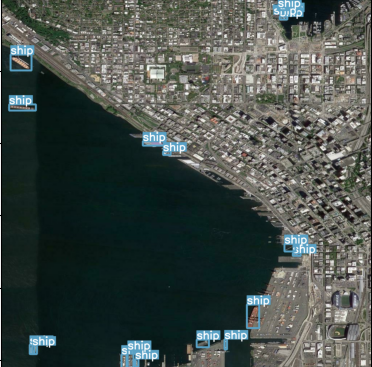

# 2nd ship detection challenge - Huggingface



Training a yolov8 on ship detection from aerial images.


You can find data [here](https://huggingface.co/spaces/competitions/ship-detection)

## Installation


```bash
pip install -r requirements.txt
```

## Training
It is an example, you must adapt path for your use case.
plz read help in the main if you don't want to preprocess data each time
```bash
#For preparing data and training yolov8
python3 main.py --origdata pathtoyourproject/shipdetection/data/original/train/ --destsplit /tmp/split --destdatayolo /tmp/yolodest --withdraw 3 --maketile False --tilesize 640 --yolov8path yolov8s --imgsz 640
```

## Inference
To run inference with ensembling, you must run the script 
at pathtoprohect/shipdetection/models/yolov5_obb-master/sub_classifandyolo.py

I have adapt the model from https://github.com/hukaixuan19970627/yolov5_obb where yolov5 
makes rotated bounding box. In the challenge I need rectangular bounding box, so I had to
modify the code for prediction.

This part is for final solution proposed: ensembling yolov8s trained on 640x640 with
yolov5 pretrained on dota.

```bash
#For preparing data and training yolov8
cd pathtoyourproject/shipdetection/models/yolov5_obb-master/

PYTHONPATH=pathtoyourproject/shipdetection/models/yolov5_obb-master/ python3 sub_classifandyolo.py
```


## Thank you

## A special thank to https://github.com/hukaixuan19970627/yolov5_obb for his pretrained model on dota

## License

[MIT](https://choosealicense.com/licenses/mit/) 

